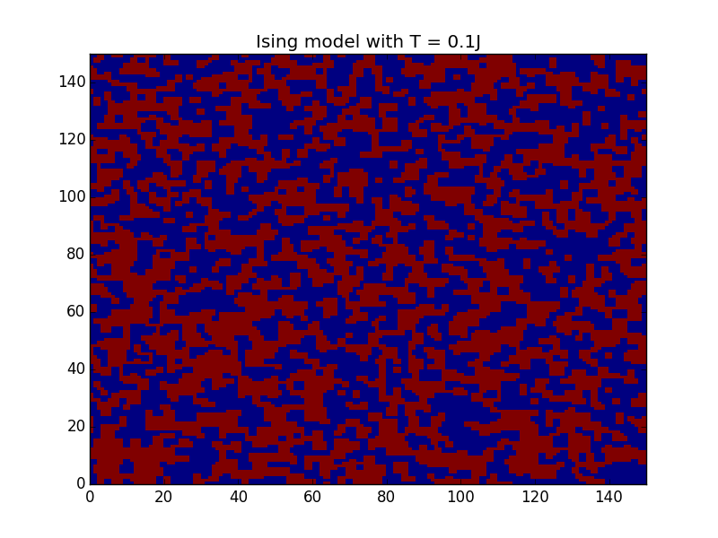
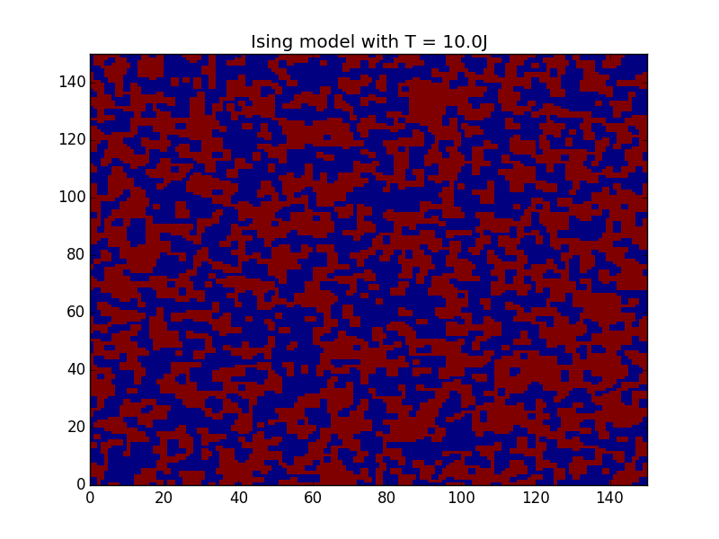
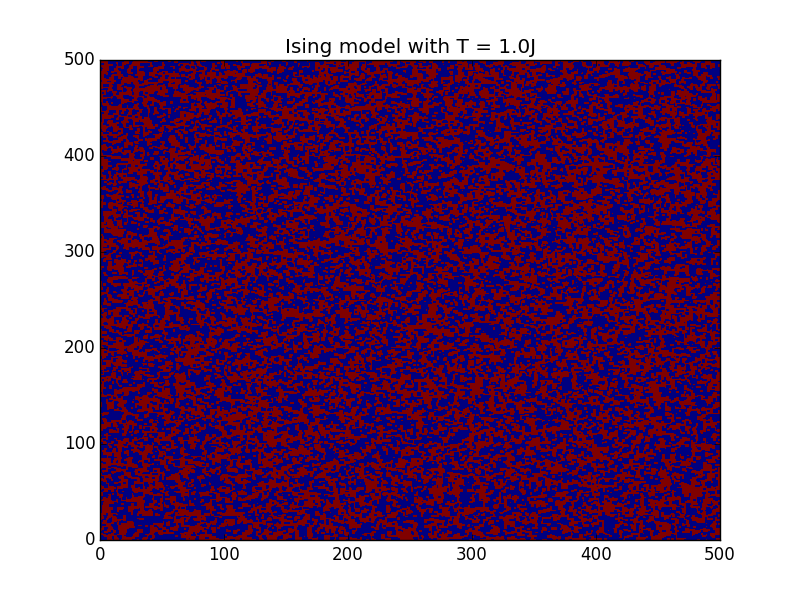
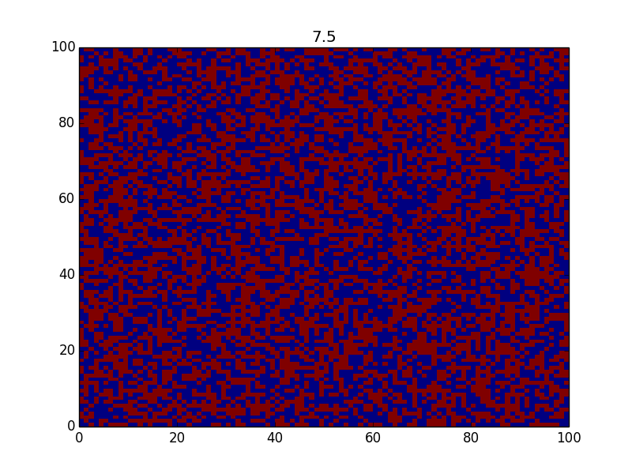

### Output and notes for Homework 7 PP10

100x100 grid, 1J temperature:

150x150 grid, 0.1J, 1J, and 10J temperature:

For funsies, 500x500 at 1J: 

### Output and notes for Homework 3 PP6

The red curve shows the isothermal transformation from A to B. The turquoise curve shows the steeper pV plot of the adiabatic transformation from A to C. The direct transformation from A to C is shown in violet.

    Isothermal transformation work: -0.026879171779
    Adiabat transformation work:    -0.02255397719
    Linear transformation work:     -0.0266054261524
    Isothermal transformation Q:    -0.026879171779
    Adiabat transformation Q:        0
    Linear transformation Q:        -0.00405286767193

The work done is calculated using numpy's `trapz` integration. No heat is exchanged with the surroundings in the adiabatic transformation. The linear transformation is calculated as the sum of the area under the curve and the specific heat capacity times the temperature difference from A to C.

---

### Output and notes for Homework 3 PP7

The grid is approximately half up and half down for T=100,10. T=1 has somewhat more down than up. T=.1 has very very few up and T=.001 has none. This is consistent with the properties of the Boltzmann function.

Calculated probabilities of e^(1/T)/2 for each would be:

T    | p
-----|--------
.001 |  2.537979448774728×10^-435
.1   |  0.0000227
1    |  0.18394
10   |  0.452419
100  |  0.495025

p for T=.001 is effectively zero since the computer would round it to zero.

This generally makes physical sense. Temperature has disordering effect. This must taper off at high temperature since there is an upper limit to the disorder of the system, which is defined by a perfectly even and random distribution of states. This is why the difference between T=1 and T=10 is much larger than the difference btween T=10 and T=100. The curve of the Boltzmann function has a region of exponential growth for very low T, a brief relatively linear for a middle range of T, and an assymptote at 1 for large T. The differences in probability and the resulting grids for each temperature demonstarte this.

